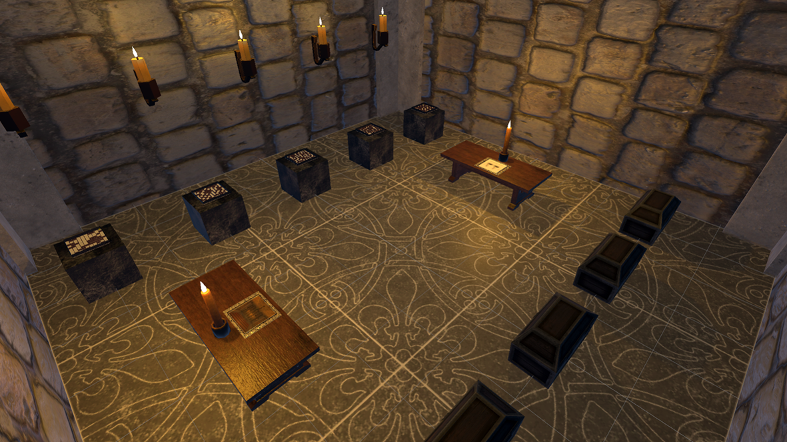
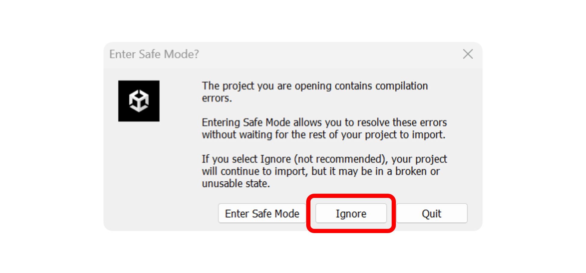
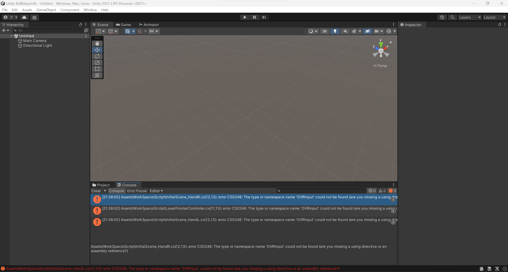

# Unity-BallLabyrinth
This is a Unity project for a VR (Virtual Reality) escape game from an ancient room of my own creation. Please note that this project is intended for Quest as a HMD  (Head-Mounted Display) and cannot be run on other devices.

<p align="center">
  
</p>
<br><br>


## 概要
Ball LabyrinthはUnity3Dで作成した古代の部屋からのVR脱出ゲームです．難易度はそれほど高くなく，誰でも簡単に楽しくプレイすることが出来ます．対象としているHMDはQuestとなっており，Quest2及びQuest3において，問題なく実行出来ることは確認済みです．Questを対象としたScriptとなっているため，その他HMDでは実行することが出来ませんのでご注意ください．また，Oculus Integrationは本リポジトリに含まれていないため，本branchをclone後に各々でimportして頂きますよう，よろしくお願いします．詳細な手順は以下に示してあります．
<br><br>


## 使用方法
1. projectのclone
    - cloneしたい階層へcmdで移動．
    - 以下のコマンドを用いて本branchをlocal repositoryへclone
    
    ```
    git clone https://github.com/MSTS-S/Unity-BallLabyrinth.git
    ```

2. projectを開く
    - (Unity Hubを用いている場合)Unity Hubでprojectをリストに追加し，projectを開く.
    - projectを開いている最中に，以下の画像ようなメッセージが表示されるが，ignoreを選択．
    - このメッセージは[Oculus Integration](https://assetstore.unity.com/packages/tools/integration/oculus-integration-deprecated-82022)が本repositoryに含まれていないことによるモノ．

    <p align="center">
        
    </p>

3. Oculus Integrationのimport
    - project起動段階では，Oculus Integrationの不足によって下の図のようにエラーメッセージが吐かれている．
    - Window > Package Managerを選択し，Oculus Integrationをimport(初めてimportする場合，[Oculus Integration](https://assetstore.unity.com/packages/tools/integration/oculus-integration-deprecated-82022)から自身のEditorへimportする)．
    - import後にconsoleを確認し，project起動後に表示されていたエラーがないことを確認．

    <p align="center">
        
    </p>

4. Platformの選択
    - HMD(Quest)でBuild And Runする場合，File > Build Settings...を選択後，AndroidへSwitch Platformを行う(Quest Linkを用いて実行する場合，この手順は不要)．
    - Build TargetがAndroidへ切り替わったら，Build And Runを押下．

    <p align="center">
        
    </p>

5. その他
    - 本ProjectのSceneはAssets > WorkSpace > Sceneの階層化に配置されている．
    - 空間CGModelのみの使用を行いたい場合，Scriptはすべて削除することを推奨(OVRクラスを使用しているScriptが複数あるため)．
<br><br>


